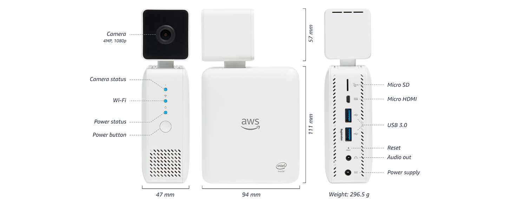

AWS DeepLens Hack
=================

## AWS DeepLens Specs
* CPU: Intel Atom® Processor
* Memory: 8GB
* OS: Ubuntu 16.04 LTS
* Built-in Storage: 16GB
* Graphics: Intel Gen9 Graphics Engine
* Supports:
  * Intel® Movidius™ Neural Compute Stick
  * Intel® RealSense™ depth sensor



## Software Update
:warning: AWS locked down the device so that it cannot receive unsanctioned OS updates.  Do not upgrade to the newer version of Ubuntu even if it has promopted that an upgrade is available.  If it is upgraded by accident and the device refuse to boot, please follow the [factory reset](https://docs.aws.amazon.com/deeplens/latest/dg/deeplens-troubleshooting-factory-reset.html) instructions to restore your device.


Other than the OS upgrade, it seems to be ok to apply update to the system modules.  To run the module update, open a terminal window and run the following commands:

```shell
sudo apt update 
sudo apt upgrade -y
```

If it prompted for awscam update, go ahead and install the update by running the following command:

```shell
sudo apt install awscam
```

## Accessing For The First Time
:warning: Don't bother to follow the device registion process as AWS has announced the end-of-life (EOL) support for DeepLens - see [AWS DeepLens End of Life](https://docs.aws.amazon.com/deeplens/latest/dg/deeplens-end-of-life.html)

To access the device for the first time, for new device or as a result of factory reset, use `aws_cam` to login to the device.  The password is `aws_cam`.  It will prompt for password reset.  Remember to first enter the existing password which is `aws_cam` and then choose a good password.

As the DeepLens is reaching EOL, it is better to disable the services integrating with AWS.  To disable the services run the [./scripts/awscam-disable](./scripts/awscam-disable) after login to the device.  The script can be downloaded via copying the raw file or cloning the git repo locally [after seeting up a different login user](#Creating-A-New-User-and-a-Linux-native-file-system-storage) to be discussed further down.

```shell
sudo ./scripts/awscam-disable
```

To see a list of running services, do

```shell
systemctl
```

## Installing Useful Software Components
The default setting does not include the channels outside of AWS.  To install some useful components such as `tmux`, `samba`, etc..., enable the following channels:
* Canonical-supported free and open-source software (main)
* Community-maintained free and open-source software (universe)

Open the software update app by pressiong windows key and type "Software" and run "Software and Updates".  Then check the corresponding check boxes for the channels.


The in a terminal window, run the following commands to install the components:
* samba - expose DeepLens files to remote host which allows us to use better editor / IDE.
* tmux - maints remote session after disconnect
* libffi-dev, libsqlite3-dev - for compiling Python and running Jupyter Lab

```shell
sudo apt update

# useful tools
sudo apt install tmux samba

# libraries for software compliation
# These are for python and Jupyter Lab
sudo apt install libffi-dev libsqlite3-dev
```

Note:
* A sample [tmux config](./misc/tmux.conf) can be copied to ${HOME}/.tmux.conf with mouse integration enabled as well as more convinent key binding than the default one.
  ```
  cp ./misc/tmux.conf ~/.tmux.conf
  ```

## Configure Firewall
The DeepLens came with Firewall turned on for security reasons.  To allow easy access and development, open the following firewall ports:
* ssh
* samba
* port 8000-9999

Note: the `samba` alias might not be available until after the samba module is installed.

```shell
sudo ufw allow ssh
sudo ufw allow samba
sudo ufw allow 8000:9999/tcp

# to check the firewall settings, run
sudo ufw status numbered

# output:
Status: active

     To                         Action      From
     --                         ------      ----
[ 1] 10.105.168.217 on mlan0    DENY IN     Anywhere
[ 2] 80                         ALLOW IN    Anywhere
[ 3] 4000                       ALLOW IN    Anywhere
[ 4] 22                         ALLOW IN    Anywhere
[ 5] 443                        ALLOW IN    Anywhere
[ 6] 8000:9999/tcp              ALLOW IN    Anywhere
[ 7] Samba                      ALLOW IN    Anywhere
[ 8] 80 (v6)                    ALLOW IN    Anywhere (v6)
[ 9] 4000 (v6)                  ALLOW IN    Anywhere (v6)
[10] 22 (v6)                    ALLOW IN    Anywhere (v6)
[11] 443 (v6)                   ALLOW IN    Anywhere (v6)
[12] 8000:9999/tcp (v6)         ALLOW IN    Anywhere (v6)
[13] Samba (v6)                 ALLOW IN    Anywhere (v6)
```

## Creating A New User and a Linux native file system storage
As AWS is not providing any update to the OS and the OS was pretty much locked down, it is better not to install anything at the system level and not to pollute the dependencies for the aws_cam user.  Misconfiguring the aws_cam user could lead to malfunction of network connectivity.  It is better to create a new user account and install the components at the user level to avoid the risk damaging the system level dependencies.

In addition, there is not much storage space left with the built-in 16GB storage after the OS installation. To compile and install newer dependences, it is required to use some external storage such as the MicroSD card to build components from source.  Thus, it is necessary use Linux native file system to store the source codes and build artifacts.  It is recommended to use the 32GB SD card (that come with the DeepLense) or larger carpacity as external storage.  Use the `fdisk` to create a native Linux partition and format it with e2fs.  Then setup a persistance mount so the file paths can be predictable.

### Prepare the SD Card Storage
The following instructions simply delete the existing partition on the SD card and create a new Linux partition.  For more sophisticated users, feel free to create the partitions on the SD card that fit for different use cases.  If the SD card only
contains a single partition, it can be simply using the (t)ype command instead of (d)elete and (n)ew a new partition.

```shell
# Switch to root user as we need to perform multiple actions
sudo -s

# List the block devices to find out the path of the block device
lsblk

NAME         MAJ:MIN RM  SIZE RO TYPE MOUNTPOINT
mmcblk0rpmb  179:24   0    4M  0 disk
mmcblk0boot0 179:8    0    4M  1 disk
mmcblk2      179:32   0 29.7G  0 disk
└─mmcblk2p1  179:33   0 29.7G  0 part /media/aws_cam/3661-3134
mmcblk0boot1 179:16   0    4M  1 disk
mmcblk0      179:0    0 14.7G  0 disk
├─mmcblk0p2  179:2    0 14.6G  0 part /
└─mmcblk0p1  179:1    0   94M  0 part /boot/efi

# Create Linux partition with fdisk by deleting the existing Windows partition 
# and create a new partition.  Then set the file system type to type ID 83 Linux. 
fdisk /dev/mmcblk2

Welcome to fdisk (util-linux 2.27.1).
Changes will remain in memory only, until you decide to write them.
Be careful before using the write command.

Command (m for help): p
Disk /dev/mmcblk2: 29.7 GiB, 31914983424 bytes, 62333952 sectors
Units: sectors of 1 * 512 = 512 bytes
Sector size (logical/physical): 512 bytes / 512 bytes
I/O size (minimum/optimal): 512 bytes / 512 bytes
Disklabel type: dos
Disk identifier: 0x00000000

Device         Boot Start      End  Sectors  Size Id Type
/dev/mmcblk2p1       8192 62333951 62325760 29.7G  c W95 FAT32 (LBA)

Command (m for help): d
Selected partition 1
Partition 1 has been deleted.

Command (m for help): n
Partition type
   p   primary (0 primary, 0 extended, 4 free)
   e   extended (container for logical partitions)
Select (default p): p
Partition number (1-4, default 1): 1
First sector (2048-62333951, default 2048):
Last sector, +sectors or +size{K,M,G,T,P} (2048-62333951, default 62333951):

Created a new partition 1 of type 'Linux' and of size 29.7 GiB.

Command (m for help): p
Disk /dev/mmcblk2: 29.7 GiB, 31914983424 bytes, 62333952 sectors
Units: sectors of 1 * 512 = 512 bytes
Sector size (logical/physical): 512 bytes / 512 bytes
I/O size (minimum/optimal): 512 bytes / 512 bytes
Disklabel type: dos
Disk identifier: 0x00000000

Device         Boot Start      End  Sectors  Size Id Type
/dev/mmcblk2p1       2048 62333951 62331904 29.7G 83 Linux

Command (m for help): w
```
Remember to take note of the UUID of the created partition.  It is needed later to configure mount in the `/etc/fstab` file.

Once the partition is updated, use the mke2fs to format the partition to e2fs.
```
# format MicroSD card as e2fs
mkfs -t ext4 /dev/mmcblk2
```

Create a mount point in the root file system.  For this example, it uses `/mnt/ext` which also can be changed as desired.

```
mkdir -p /mnt/ext
```

To automatically mount the during start up, add the following entry to /etc/fstab.  Note the UUID should be replaced to the
UUID from the output of fdisk when the partition was created.  The UUID can also be found with `blkid` command:

```shell
blkid

/dev/mmcblk0: PTUUID="7b61f71c-add4-43ab-8bc4-fc5b6db22e80" PTTYPE="gpt"
/dev/mmcblk0p1: UUID="EC97-640C" TYPE="vfat" PARTUUID="a6a77533-9f2c-4e49-9e20-fda8be912501"
/dev/mmcblk0p2: UUID="a0b62c85-25f6-4429-a9fc-b5560b0eb096" TYPE="ext4" PARTUUID="d855bc51-ed2b-426c-89cf-d149ca740e0c"
/dev/mmcblk2: PTTYPE="dos"
/dev/mmcblk2p1: UUID="cebcb1b8-927d-441e-a899-728c541d80c1" TYPE="ext2"```
```

Add the following entry (update the UUID accordingly) to `/etc/fstab`.  Note the `nofail` option which allows the OS to 
contiue boot sequence in case the SD card is not present or damaged.
```
UUID=cebcb1b8-927d-441e-a899-728c541d80c1       /mnt/ext        ext4    defaults,nofail 0       2
```

Mount the partition before proceed to the next step:
```shell
mount -a

# double check to make sure the partition is mounted
df -h

Filesystem      Size  Used Avail Use% Mounted on
udev            3.8G     0  3.8G   0% /dev
tmpfs           781M   39M  742M   5% /run
/dev/mmcblk0p2   15G  7.1G  6.5G  53% /
tmpfs           3.9G  336K  3.9G   1% /dev/shm
tmpfs           5.0M  4.0K  5.0M   1% /run/lock
tmpfs           3.9G     0  3.9G   0% /sys/fs/cgroup
/dev/mmcblk0p1   99M   50M   50M  50% /boot/efi
/dev/mmcblk2p1   30G   12G   17G  43% /mnt/ext
tmpfs           781M   60K  781M   1% /run/user/1002
```

### Create a new OS user
As previously mentioned, it is better to use a separate user so not to pollute the existing system library and causing
issues.  This instruction use `adduser` wrapper script to create an OS user `dwu` with home directory set to `/mnt/ext/dwu`
, it is ok to chose any user name and other directory path on the SD card as desired.  

```
# Assuming we are adding a new data working user `dwu`
adduser dwu --home /mnt/ext/dwu

# Add user to user groups
usermod -a -G adm dwu
usermod -a -G sudo dwu
usermod -a -G aws_cam dwu
```

### Config SAMBA
The default SAMBA configuration doesn't expose users' home directory.  Uncomment the following sections in `/etc/samba/samba.conf`

```
[homes]
   comment = Home Directories
   browseable = no
```

Then restart the SAMBA services

```shell
sudo systemctl restart smbd.service
sudo systemctl restart nmbd.service
```

Now the user's home can be access from remote computer.

## Clone the Git repo
This repo contains some convinent scripts and configuration and can be cloned to the user account just created to make the following steps
simpler.

```shell
# ssh to DeepLens as the recently created user, which should have the home directory set to the SD card
# clone this repo from github.com
git clone https://github.com/danielwu68/aws-deeplens-hack.git

cd aws-deeplens-hack
source ./scripts/env-setup
```

Also add the following to `${HOME}/.profile`
```
source ${HOME}/aws-deeplens-hack/bin/env-setup
```

## Build From Source
Pip in Python requires ssl library to acces the repo.  Thus, it is required to build and install the OpenSSL library.  The following instructions
assume the necessary environment variables were setup properly via sourcing the `env-setup` mentioned above.  Also the NodeJS is required for
running Jupyter Lab.  Download and extract the package with the commands listed below.

Note:
  * At the time of writing, the followings are the most recent and compatible versions:
    * OpenSSL: openss-3.0.11 (Long Term Support - LTS) and openssl-3.1.3 are available.  This instruction will use the LTS [openss-3.011](https://www.openssl.org/source/openssl-3.0.11.tar.gz).
    * NodeJS: node-v16.20.2 which can be found at https://nodejs.org/en/download/releases
    * Python: 3.11.5 can be found at https://www.python.org/ftp/python/


```shell
mkdir ~/build ~/install ~/Downloads
cd ~/Downloads

curl -kO https://www.openssl.org/source/openssl-3.0.11.tar.gz
curl -O https://www.python.org/ftp/python/3.11.5/Python-3.11.5.tar.xz
curl -O https://nodejs.org/download/release/v16.20.2/node-v16.20.2-linux-x64.tar.xz

# Extract directly into install folder for the ones come with binary
cd ~/install
tar xvf ~/Downloads/node-v16.20.2-linux-x64.tar.xz

# Extract into build folder for the ones need to be built
cd ~/build
tar xvf ~/Downloads/openssl-3.0.11.tar.gz
tar xvf ~/Downloads/Python-3.11.5.tar.xz
```

### Build OpenSSL
```shell
cd ~/build/openssl-3.0.11
# configure the build with custom target directories
./config --prefix=${OPENSSL_HOME} --openssldir=${OPENSSL_HOME}/ssl
# start the build process
make
# optionally after successful build, run validation tests
make test
# install the artifects to target directory
make install
```

### Build Python
```shell
cd ~/build/Python-3.11.5
```

To enable SSL support, which is needed by pip, uncomment the following lines in `Modules/Setting``.

Note, this is specific to Python 3.11,5.  It can be different for different Python version:
```
# To statically link OpenSSL:
 _ssl _ssl.c $(OPENSSL_INCLUDES) $(OPENSSL_LDFLAGS) \
     -l:libssl.a -Wl,--exclude-libs,libssl.a \
     -l:libcrypto.a -Wl,--exclude-libs,libcrypto.a
 _hashlib _hashopenssl.c $(OPENSSL_INCLUDES) $(OPENSSL_LDFLAGS) \
     -l:libcrypto.a -Wl,--exclude-libs,libcrypto.a
```

```shell
# configure the build with custom target directory
./configure --prefix=${PYTHON_HOME} 
# build and install
make \
  OPENSSL_INCLUDES=-I${OPENSSL_HOME}/include \
  OPENSSL_LDFLAGS="-L ${OPENSSL_LIB} -Wl,-rpath,${OPENSSL_LIB}" \
  install
```

### Setup Jupyter Lab Server
This example uses `pipenv` to create the Python virtual environment.  If desired, other Python virtual environment can be used.
Please refer to specific Python virtual environment took kit for details.

```shell
pip3 install pipenv
cd ${HOME}/aws-deeplens-hack/jupyter
pipenv shell --python 3.11
pipenv install -r requirements-dev.txt
```

For convinence sake, use the tmux to start the Jupyter Lab.  Use the URL display on the output to connect to the Jupyter Lab server.
Please modify the URL so that it reflects the correct hostname or IP address if connect from remote machine.

```shell
tmux
cd ${HOME}/aws-deeplens-hack/jupyter
./start-server.sh
```